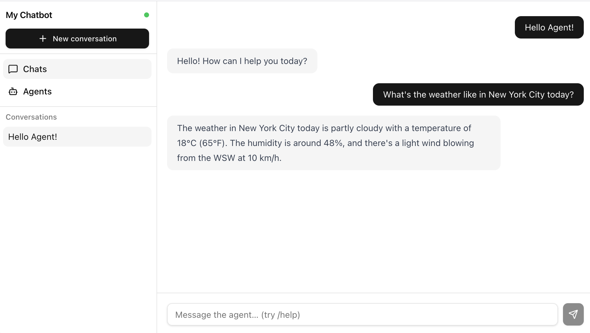
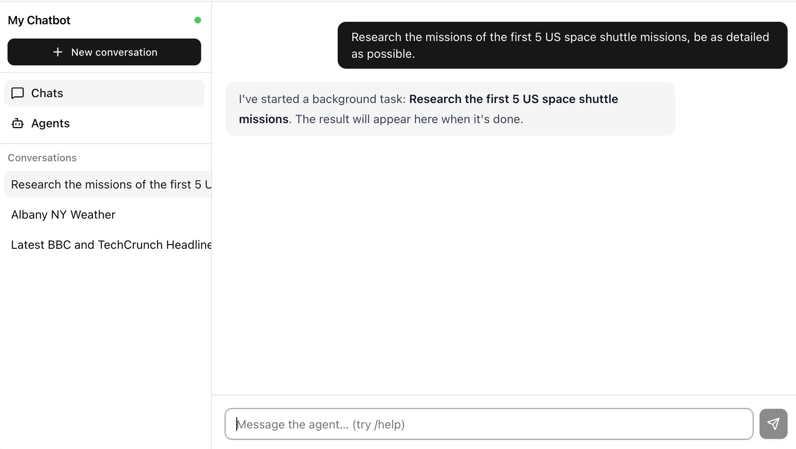
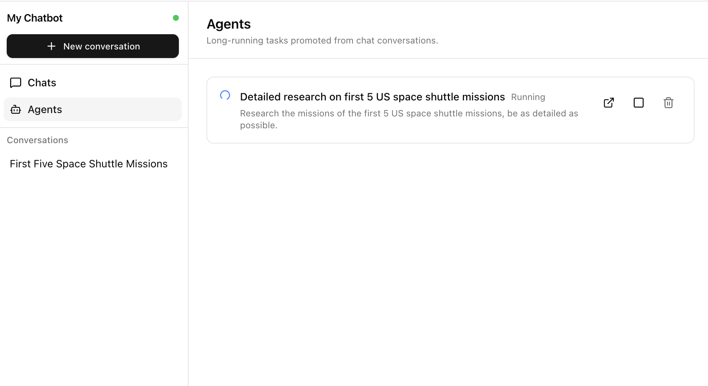
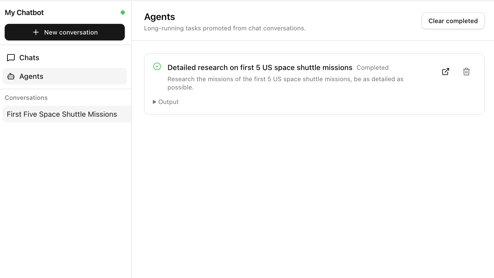
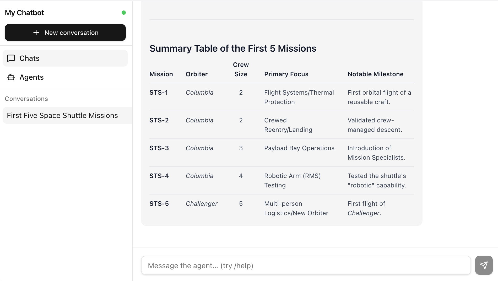

**Note: AgentTools have moved to their own repository: [https://github.com/richstokoe/AgentTools](https://github.com/richstokoe/AgentTools)**

# Better .NET Templates
Better Templates provides templates for .NET developers that are designed around good practices and patterns.

[](https://github.com/richstokoe/better-dotnet-templates/actions/workflows/dotnet.yml)
[](https://www.nuget.org/packages/RichStokoe.BetterTemplates)
[](https://www.nuget.org/packages/RichStokoe.BetterTemplates)

The default .NET templates are revised frequently to showcase new runtime features, which often means reinforcing anti-patterns (technology-centric folder layouts, an ever-expanding `Program.cs`, mixed concerns). Better Templates aims to provide a set of stable templates that help you build long-lasting, well-architected applications that scale.

## Installation

```
dotnet new install RichStokoe.BetterTemplates
```

Or install locally during development:

```
dotnet new install <path-to-nupkg>
```

---

## MVC with Feature Slices (`better-mvc`)

The standard `dotnet new mvc` template organises code by technology layer: a `Controllers/` folder, a `Models/` folder, a `Views/` folder. This feels tidy at first, but as an application grows it becomes a navigation burden. Adding a new "Checkout" feature means touching three separate top-level folders. The folders become ever-expanding dumping grounds rather than meaningful boundaries.

With the "better-mvc" template, code is organised by feature. Each feature gets its own folder containing everything it owns:

```
MyApp/
├── Home/
│   ├── HomeController.cs
│   └── Views/
│       ├── Index.cshtml
│       └── Privacy.cshtml
├── Checkout/
│   ├── CheckoutController.cs
│   ├── CheckoutService.cs
│   ├── CheckoutViewModel.cs
│   └── Views/
│       ├── Index.cshtml
│       └── Confirm.cshtml
├── Shared/
│   ├── ErrorViewModel.cs
│   └── Views/
│       ├── _Layout.cshtml
│       └── Error.cshtml
├── SetupServices.cs
├── SetupPipeline.cs
└── Program.cs
```

The Razor view engine is configured to look for views in `/{Feature}/Views/{Action}.cshtml` before falling back to the conventional `Views/{Controller}/{Action}.cshtml` paths, so you can adopt the feature-slice layout incrementally when migrating an existing app.

`Program.cs` stays thin. Service registrations live in `SetupServices.cs` and middleware configuration in `SetupPipeline.cs`, both as extension methods on the builder/app — easy to find, easy to split further if needed.

**Usage**

```
dotnet new better-mvc -n MyApp
dotnet new better-mvc -n MyApp --framework net8.0
```

Supported frameworks: `net8.0`, `net9.0`, `net10.0` (default).

---

## React + TypeScript SPA with MVC Back End (`better-hybrid`)

Microsoft have mostly abandoned their SPA templates. The original `dotnet new react` template used a development proxy and `UseProxyToSpaDevelopmentServer`, which added configuration complexity and a fragile dev-time dependency. More fundamentally, it didn't give you a clear model for how the front and back ends would relate in production.

The BetterTemplates template produces a single deployable .NET application that serves a Vite-built React front end as static files from `wwwroot/`, alongside an MVC back end for server-side concerns (authentication flows, API endpoints, error pages, server-rendered fallbacks).

The React app lives in `ClientApp/` and is built with Vite. `vite.config.ts` outputs directly into `wwwroot/` so there are no separate deployment artefacts to coordinate. `MapFallbackToFile("index.html")` means the React router handles all client-side routes, while MVC controllers intercept any routes explicitly registered (e.g. `/login`, `/error`).

The MVC back end uses the same feature-slice layout as `better-mvc`:

```
MyApp/
├── ClientApp/           # React + TypeScript (Vite)
│   └── src/
├── Home/
│   ├── HomeController.cs
│   └── Views/
│       └── Error.cshtml
├── Shared/
│   ├── ErrorViewModel.cs
│   └── Views/
│       └── _Layout.cshtml
├── wwwroot/             # Built SPA output lands here
├── SetupServices.cs
├── SetupPipeline.cs
└── Program.cs
```

The `.csproj` automatically runs `npm install` on a debug build if `node_modules` is missing, and runs `npm run build` as part of `dotnet publish`.

**Usage**

```
dotnet new better-hybrid -n MyApp
dotnet new better-hybrid -n MyApp --Framework net8.0
```

Supported frameworks: `net8.0`, `net9.0`, `net10.0` (default).

**Prerequisites**: Node.js must be installed for the front-end build steps.

---

## AI Agent Console App (`better-agent`)

The `better-agent` template produces a ready-to-run AI agent console application built on the [Microsoft Agent Framework](https://github.com/microsoft/Agents-for-dotnet) and `Microsoft.Extensions.AI`. It comes pre-wired with DI, `appsettings.json` configuration, and a multi-turn streaming conversation loop so you can start adding your own tools and logic immediately.

```
MyAgent/
├── Agent/
│   └── AgentRunner.cs      # Multi-turn conversation loop (streaming)
├── SetupServices.cs        # DI registration — wire up your IChatClient here
├── Program.cs
├── appsettings.json        # Placeholder config for Azure OpenAI / OpenAI keys
└── appsettings.Development.json
```

`AgentRunner` manages the session (conversation history) and runs a `while` loop reading from `Console`, calling the agent with streaming output, and handling errors. It is registered as a scoped DI service so you can inject additional dependencies — memory, vector stores, external APIs — as your agent grows.

`SetupServices.cs` contains commented-out examples for Azure OpenAI, OpenAI, and LM Studio so you can uncomment the provider you want and drop in credentials without hunting through documentation. The default out-of-the-box configuration targets a local LM Studio instance so the template runs without any API keys.

Tool use is handled by `RichStokoe.AgentTools`, which discovers tool methods across all loaded assemblies via `[AgentTool]` attributes and registers them with the agent automatically.

**Usage**

```
dotnet new better-agent -n MyAgent
dotnet new better-agent -n MyAgent --framework net8.0
```

Supported frameworks: `net8.0`, `net9.0`, `net10.0` (default).

---

## Web Agent App (`better-webagent`)

A web-based conversational AI agent similar to `better-agent` but with a real-time React + TypeScript frontend. Intuitive UI with persistent conversation sidebar, streaming responses, slash commands, an inline "thinking" view, and automatic promotion of long-running tasks to a separate Agents tab — with results posted back into the originating chat when complete.

Include tools out of the box from [RichStokoe.AgentTools](https://github.com/richstokoe/AgentTools):



```
MyWebAgent/
├── Chats/                  # Conversation feature slice
│   ├── ChatHub.cs          # SignalR hub — clients connect to /hubs/chat
│   ├── ChatSession.cs      # Domain model
│   ├── ChatMessage.cs      # Domain model
│   ├── IChatRepository.cs  # Storage abstraction — swap for SQLite/Postgres/etc.
│   └── InMemoryChatRepository.cs
├── Agents/                 # Long-running task feature slice
│   ├── AgentHub.cs         # SignalR hub — clients connect to /hubs/agents
│   ├── AgentTask.cs        # Domain model
│   ├── AgentTaskRunner.cs  # Background task orchestrator
│   ├── IAgentTaskRepository.cs
│   ├── InMemoryAgentTaskRepository.cs
│   ├── WebAgent.cs         # IChatClient wrapper with COT system prompt
│   └── WebAgentFactory.cs  # Classification + title generation
├── SlashCommands/          # Extensible slash command registry
│   ├── ISlashCommand.cs
│   ├── SlashCommandRegistry.cs
│   ├── ClearCommand.cs     # /clear — wipe the current conversation
│   ├── NewCommand.cs       # /new   — start a new conversation
│   └── HelpCommand.cs      # /help  — list all registered commands
├── ClientApp/              # React + TypeScript SPA (Vite, Tailwind v4, shadcn/ui)
│   └── src/
│       ├── hooks/          # useChatHub, useAgentHub
│       ├── components/     # Sidebar, Chat, AgentsPage, ThinkingBlock, ui/*
│       ├── lib/utils.ts
│       ├── App.tsx
│       └── main.tsx
├── SetupServices.cs        # DI for hubs, repositories, IChatClient, slash commands
├── SetupPipeline.cs        # Maps /hubs/chat and /hubs/agents
└── Program.cs
```

**Key concepts**

- **Two SignalR hubs.** `ChatHub` handles conversations and streams response tokens. `AgentHub` handles long-running tasks. Both push updates to clients in real time over WebSockets.
- **Chain of thought.** The system prompt asks the model to wrap reasoning in `<think>...</think>` tags. The frontend detects these during streaming and renders them as a collapsible block above the answer. Works with any model — no provider-specific thinking-token API required.
- **Markdown + syntax-highlighted code** in every response, via `react-markdown` + `remark-gfm` + `rehype-highlight`.
- **Slash commands.** Implement `ISlashCommand`, register in `SetupServices.cs`. The template ships with `/clear`, `/new`, and `/help`.
- **Auto-generated titles.** A new conversation gets a provisional title (the first 60 chars of the user's message) immediately, then a concise LLM-generated title swaps in via `ChatUpdated` once the background call resolves.
- **Repository pattern.** `IChatRepository` and `IAgentTaskRepository` abstract storage. The defaults are in-memory `ConcurrentDictionary` implementations (state lost on restart). Swap the DI registration for an EF Core / Dapper / Marten / etc. implementation when you need persistence — no other code needs to change.
- **Fully anonymous.** No auth, no per-user scoping. Conversation history is server-wide.

**Long-running tasks — automatic promotion to the Agents tab**

Every user message is first run through a tiny LLM classification call that decides whether this is a quick chat (`direct`) or a complex, long-running task (`agentic`). Agentic prompts are promoted into a background `AgentTask` so the chat UI stays responsive — the user gets an immediate acknowledgement in the conversation:



The task itself runs on the server with its own SignalR hub feeding the Agents tab. The tab shows live status (Pending / Running / Completed / Failed / Cancelled), the originating prompt, and lets the user stop, delete, or jump back to the originating chat:



The Agents list shows when the task is complete. You can jump back into the conversation you triggered the long running task from or delete the task (doesn't delete the response in the conversation).



When the task completes, its output is posted back into the originating chat as a regular agent message, fully markdown-rendered:



**Usage**

```
dotnet new better-webagent -n MyWebAgent
dotnet new better-webagent -n MyWebAgent --framework net8.0
```

Supported frameworks: `net8.0`, `net9.0`, `net10.0` (default).

**Prerequisites**: Node.js **20+** (Tailwind v4 native bindings require it). The default LLM provider in `SetupServices.cs` points at a local LM Studio instance so the template runs out of the box with no API keys — switch to Azure OpenAI or OpenAI using the commented-out blocks in the same file.

---

## Contributing

Templates are under `templates/`. The package is built with:

```
dotnet pack -c Release
```

To test locally after building:

```
./reinstalltemplate.sh
```

---

## License

[MIT](LICENSE) — provided as-is, without warranty of any kind. See the [LICENSE](LICENSE) file for the full terms.
